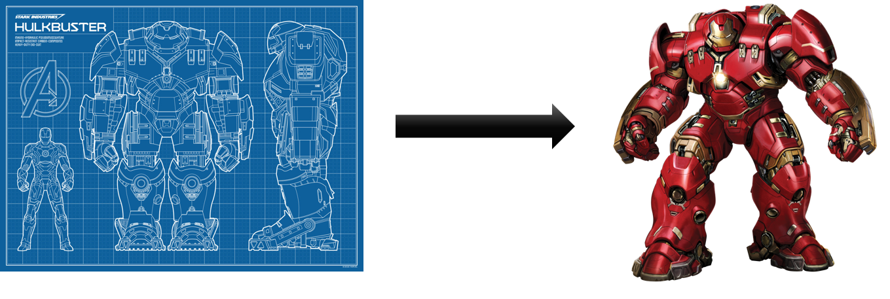
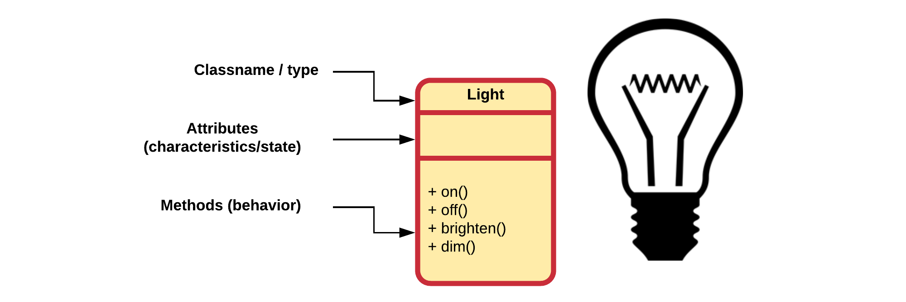
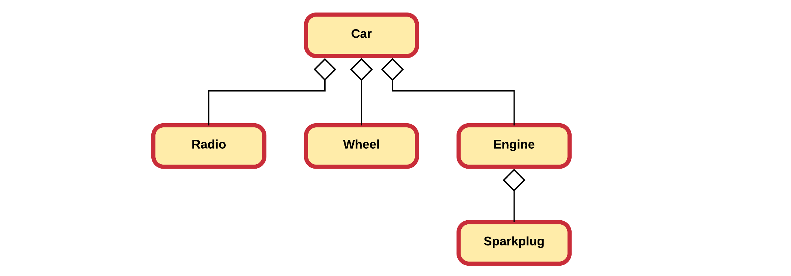

# All About Objects

This chapter will give a detailed introduction in the concepts of object oriented thinking when using an object oriented programming (OOP) language such as Java or C++. This chapter will not include any language specific language examples. Everything will be language independent and supported using UML (Unified Modeling Language) class and object diagrams.

<!-- TODO: Place a picture here with all keywords of OOP. Maybe even write it by hand. -->

## What are Objects

What is an object ?

Sounds like a complex question, but the answer is actually really simple. Humans already tend to **think in terms of objects**, without taking to much effort. Students already know about objects, even if they don't realize it.

Actually **all things around us can be considered objects**: a chair, a table, a monster truck, an electricity outlet, a window, a student, a teacher, ... but also more abstract things such as a bank account, a computer file, a chemical element, ... When thinking in terms of objects in software design we will find such objects as an email, a browser, a text message, a mouse, an icon on your desktop, ... All these things are examples of objects.

Basically one can state that something is an object if it has:
* **a name**;
* certain **characteristics**;
* certain **actions** that can be done to it or can be accomplished with it.

### Object Characteristics

If you are reading this in a classroom, than take a look around you. Try to focus on a person in the room. She/he is the perfect example of an object. First of all he/she has a name which uniquely identifies this person.

Now try to identify some characteristics of this person. Some examples could be his/her:
* name
* age
* eye color
* gender
* position (sitting, standing, laying down, ...)
* height
* ...

In object oriented programming these **characteristics** are often referred to as the **attributes** or **properties** of an object. They define the **data** that contain the current **state** of the object at any given moment.

Each object holds its own state. This means that you can have a person in the classroom that is sleeping and another that is sitting straight. If one person grows an inch over a couple of months, this does not mean the others do so too. They each have their own individual state.

### Object Behavior

Take another look at someone in the classroom. What actions can a person perform ? He/she can:

* walk
* sleep
* talk
* eat something
* wake up
* stand up
* ...

In object oriented programming these are called the **methods** of an object. They define the possible **behavior** of an object.

Most of the actions that are performed by or to an object are based on the current state of the object. If a person is not hungry he/she will react differently when given an apple than when you have been starving him/her for weeks.

### Objects Talk to Each other

Most objects will only become useful if they can **interact with other objects**. Take for example a chair in the middle of a room full of people. The chair is pretty useless until someone decides to sit on it.

Interaction between objects in a software program is accomplished by an object sending a **message** to another object. Of course it is part of your job as a programmer to determine which objects send messages to each other and when. In an object oriented programming language sending a message from one object to another is accomplished by **calling a method** of an object.

Take a look at the following example. It defines two people (objects): Xander and Elysa. Both have their own state (attributes or data) and have certain actions that they can perform (run, sleep, eat, ...). The diagram shows that Elysa is sending a message to (calling the awake() method) Xander who is asleep.

While the diagram above is no official standard it does however places a base for the UML standard that will later be used in this course. Note how attributes and methods are separated. It also shows some programming basics such as the parentheses after a name of a method or the naming conventions of the attributes.

### Definition of an Object

All this leads to a more formal definition of an object:

> #### Definition::Object
>
>  An object is an entity that contains both **data** (*attributes*) and **behavior** (*methods*). Objects exchange information with each other and request actions from one another by sending messages. In code this is achieved by calling the methods of the objects. These methods can act upon the current state of the object and also make changes to it.

### Quick Summary

* Objects are the building blocks of an OO program
* A program is basically a **collection of objects**
* An **object** is an **entity** that contains both data and behavior
  * **Data** represents the state of the object and is represented by **attributes** of the object
  * **Behavior** represents what the object can do in the form of **methods**
* Objects **interact** with each other by sending messages
  * In the form of **method calls**

## Why OOP

Before the mid 1970s software engineers followed a programming methodology called **structured programming**.

> #### Info::Structured Programming

> Structured programming is a programming paradigm aimed at improving the clarity, quality, and development time of a computer program by making extensive use of subroutines, block structures, for and while loops—in contrast to using simple tests and jumps such as the `goto` statement, which could lead to "spaghetti code" that is difficult to follow and maintain. It emerged in the late 1950s with the appearance of the ALGOL 58 and ALGOL 60 programming languages, with the latter including support for block structures.

The structured paradigm offered a simple approach to software engineering by providing a simple view on a software product. An application was considered to be either *operation oriented* or *data oriented*. In the case of operation oriented applications the focus lies on the functions that the application performs as where data oriented focused on the data being handled. However as software development began to evolve and applications became more complex, developers realized that this approach was to narrow sighted.

New software concepts began to emerge, one of which was the object oriented paradigm. This became of the most popular and most influential ones. Instead of breaking software down into either data or operations, object oriented programming took another approach by dividing application into **abstract software artifacts called objects**. Objects are **designed to keep both data and operations together** as a logical entity.

Take for example a car. In structured programming the properties of the car and the actions it could perform would be kept separately. Take for example physical characteristics such as its color, serial number, engine type, number of seats, ... is kept separate from actions such as steering, accelerating, slowing down, stopping, ...

Applying the object oriented paradigm, all these properties (called attributes then) and actions (called methods then) would be combined into a single logical entity (the object) called a **Car**. An car object is able to use its internal attributes and perform certain actions. It can be thought of as a single independent unit rather than an separated but entangled bunch of functions and data.

### List of Numbers

Let us take a look at a more software oriented example. Take for example a simple application that holds a list (an array) of integers taken as input from the user. The application has at least two properties to track: the numbers themselves and how many entries are in the array.

Now the user is able to select what operation to perform on the list of numbers: reverse the list, make the sum, make the average, print the list to the screen, ...

Taking the structured programming approach the data and operations would be totally separate from each other as demonstrated in the diagram below.

As can be seen above, all data required for the operations need to be passed to the functions or they need to be made globally available which is even worse.

Now taking the object oriented approach a nice independent entity called `ListOfNumbers` can be engineered. It holds both the integers and the number of elements internally. Several actions can be requested from such an object such as `sort()`, `reverse()`, `print()`, ... Take note that the data does not need to be passed to the actions as they already have access to it as the internal state of the object.

While not only cleaner, more logical and maintainable, the object oriented approach also provides us with a lot more options for reusing code.

## Classes

Aristotle was one of the first to study the concept of **type**. He spoke of *the class of fishes and the class of birds*. The idea is that each object is unique (because of their state) but is also part of a class of objects that share characteristics and behavior.

### Creating Objects

Object do not just sprout from memory when needed. In a computer program, objects are created based on a sort of blueprint, called a **class**. The objects that are created based on this particular class are called it's **instances**.

The fundamental keyword `class` was first used in Simula-67, the first object oriented programming language, and allowed for the creation of new types in the program.

The number of objects that can be **instantiated** from a class is only limited by the memory available in the system the program is running on.

Metaphorically you can compare creating objects with baking cookies.

The dough we use is basically the computer memory we have at our disposal.

The template for our cookie is the class.

The resulting cookies are the instances of the class called objects.

When we create objects we instantiate totally distinct instances of a class. **Each object contains its own copy of the data**. This means that if you change the data of one object, it will not affect the data of another object; at least not for primitive data types as we will see later on.

### Definition of a Class

All this leads to a more formal definition of a class:

> #### Definition::Class
>
>  A class is a "group, set or kind sharing common attributes". They are the essential blueprints used to create unique objects from the class type. All objects created from a single class are called instances of that particular class.

## Interface of an Object

Objects can be manipulated by sending them messages. Objects satisfy the requests that are being send to them (ex. draw something on the screen, complete a bank transaction, download a file from the Internet, ...).

In practice, a *contract* is created between the creator of the class and the user of the class, which defines what messages can be send to a certain class of objects. This contract is realized by the **interface** of the objects. In other words the interface of a class establishes what requests you can make to its objects.

There must however be code somewhere to satisfy the requests. This along with the hidden data comprises the *implementation* of the class.

So summarized: a type (class) has a method associated with each the possible requests (the interface) that can be made to the objects of that class. When a message is send to an object, the corresponding method is called, and the object figures out what to by executing the code that forms the implementation of that method.

Lets take a look at a simple example such as a light bulb. It might be represented as shown below.

The diagram above follows the UML standard (Unified Modeling Language). The diagram consists of three parts:

* The top box shows the **name of the class**. In this case Light. Note how the class name begins with a capital letter and is in the singular form.
* Below that is a list of **attributes**. They contain the characteristics or state of the objects that will be created from the class.
* Last is the box with the **methods** that are available for the class.

Except for the name of the class, the other parts of the diagram are optional and are only added when useful.

## Reusing Implementation

Once a class has been created and hopefully tested it should ideally represent a useful unit of code.  In this case it begs to be reused and not go to waste. It also turns out that code reuse is one of the main advantages of object oriented programming.

> #### Warning::Reuse and DRY
>
> Code reuse is not, as some understand it to be (students in particular), the ability to be copy pasted from one part inside your program to another! This is actually *code duplication* and is considered bad practice. The DRYness (DRY - Don't Repeat Yourself) of once code is one of the indicators of the maintainability of that code.

Multiple ways exist to reuse a class:

* **Association**: Just use the objects of a class.
* **Composition** and **Aggregation**: Build classes that consist of other objects.
* **Inheritance**: Extend an existing class by inheriting from a base class.

Do note that the this relationship depends on the actual definition of the Student and Teacher classes. In other words, it can differ from application to application.

### Association

The simplest way to reuse a class is by creating objects from it and using those objects. In other words an object of one class may use services/methods provided by an object of another class. This kind of relationship is termed as an **association**.

An association represents a relationship between two or more objects where all objects have their own lifecycle and there is no owner. The name of an association specifies the nature of relationship between objects. This is represented in UML by a solid line.

> #### Info::Life Cycle
>
> The life cycle of an object is the time between an object's creation and its destruction. Rules for object lifetime vary significantly between languages, in some cases between implementations of a given language, and lifetime of a particular object may vary from one run of the program to another.

Let's take an example of relationship between Teacher and Student. Multiple students can associate with a single teacher and a single student can associate with multiple teachers. But there is no ownership between the objects and both have their own lifecycle. Both can be created and deleted independently.

Another example could be an Employee who uses instances of the class Company Computer. While the computer objects are owned by the employee's company, he can make use of them.

### Composition

It's natural to think of **objects as collections of other objects**. Think about a television which contains a tuner, a screen, a power supply, an embedded system, ... We say that a television object is **composed** of these other objects. Luckily this same concept is available to us in an object oriented programming language. We can also create objects by bundling other objects. This has the big advantage that we can use objects from classes that someone else made or are part of the language libraries. This saves us a lot of time and effort. This sort of code reuse is one of the major advantages of object oriented languages.

In a composition relationship child objects do not have their own lifecycle. If a parent object is destroyed, all its child objects will also be destroyed. This represents a "death-relationship". In UML this is represented by a solid diamond followed by a line.

Let's take an example of relationship between a House and a Room. House can contain multiple rooms, but there is no independent life of Room and a Room cannot belong to two different houses. If we destroy the house, the rooms will automatically be destroyed too.

So composition implies a relationship where the child cannot exist independent of the parent.

Take for example an object of class Person that is composed of other objects such as a head, two feet, a heart, ... If the person is destroyed his/her limbs and organs also die. This of course does not take into account organ transplantation.

### Aggregation

Aggregation implies a relationship where the child can exist independently of the parent.

**Aggregation** is a specialized form of association where all object have their own lifecycle but there is ownership. This represents "whole-part or a-part-of" relationship between the aggregate (whole) and a component part. In UML this is represented by a hollow diamond followed by a line.

Let's take an example of a relationship between Department and Teacher. A Teacher may belong to multiple departments. Hence Teacher is a part of a Department. But if we delete a Department object, no Teacher objects will be destroyed.

Take for example a Car. If the parts of the car can be reused after the car is destroyed, than we can create a Car as an aggregation of Wheels, an Engine, a Radio, ...

### Summarized

While a clear distinction is made here between aggregation and composition, it is not always so clear in practice. Often one does speak of composition even if he/she were to mean aggregation. As a result this course may also use the word composition where aggregation is meant. Of course in cases where a clear distinction is needed, the correct term will be used.

To sum it up, association is a very generic term used to represent when one class uses the functionalities provided by another class. It's a composition relationship if one parent class object owns another child class object and that child class object cannot meaningfully exist without the parent class object. If it can then it is called aggregation.

## Characteristics of OOP

Alan Kay, a renowned computer scientist, listed the five characteristics of Smalltalk, the first successful object oriented programming language and one of the languages on which C++ is based. They summarize the characteristics that represent a pure approach to object oriented programming:

1. **Everything is an Object.** An object contains both data and behavior (this is  also knows as *encapsulation*). It keeps state and can satisfy outside requests by performing operations on itself. You can basically create objects of any conceptual component in the problem you are trying to solve (people, buildings, lists, records, ...).

2. **A program is a bunch of objects telling each other what to do by sending messages.** To make a request of an object, a message needs to be send to it. This will call a certain method of that particular object.

3. **Each object has its own memory made up of other objects.** Think of this as creating another type of object by packaging together other objects, this will later be seen as what is called *composition*. This allows us to hide complexity behind the simplicity of objects. In other words, objects allows to create new levels of abstraction.

4. **Every object has a type.** Or in OOP lingo, each object is an *instance* of a *class* in which class actually is a synonym of type. A class defines what messages can be send to the objects of that particular class.

5. **All objects of a particular type can receive the same messages.** This is a bit more complex than it sounds. Basically, an object of type *circle* is also an object of type *shape*, meaning that a circle object will be guaranteed to also accept shape messages. This is where *polymorphism* comes into play: meaning you can write code that talks to shapes and automatically handles other objects that also fit the description of shapes, such as circles. This *substitutability* forms one of the most powerful concepts of OOP.
