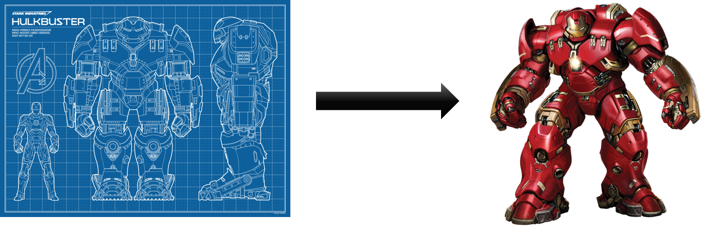
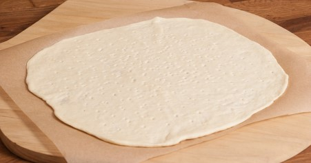
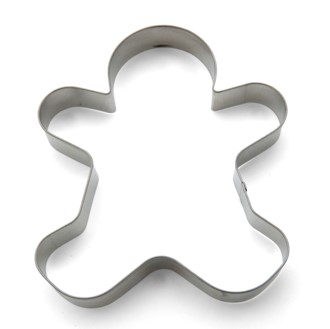

## Classes

Aristotle was one of the first to study the concept of **type**. He spoke of *the class of fishes and the class of birds*. The idea is that each object is unique (because of their state) but is also part of a class of objects that share characteristics and behavior.

### Creating Objects

Object do not just sprout from memory when needed. In a computer program, objects are created based on a sort of blueprint, called a **class**. The objects that are created based on this particular class are called it's **instances**.

The fundamental keyword `class` was first used in Simula-67, the first object oriented programming language, and allowed for the creation of new types in the program.

The number of objects that can be **instantiated** from a class is only limited by the memory available in the system the program is running on.

Metaphorically you can compare creating objects with baking cookies.

The dough we use is basically the computer memory we have at our disposal.

The template for our cookie is the class.

The resulting cookies are the instances of the class called objects.

When we create objects we instantiate totally distinct instances of a class. **Each object contains its own copy of the data**. This means that if you change the data of one object, it will not affect the data of another object; at least not for primitive data types as we will see later on.

### Definition of a Class

All this leads to a more formal definition of a class:

> #### Definition::Class
>
>  A class is a "group, set or kind sharing common attributes". They are the essential blueprints used to create unique objects from the class type. All objects created from a single class are called instances of that particular class.
