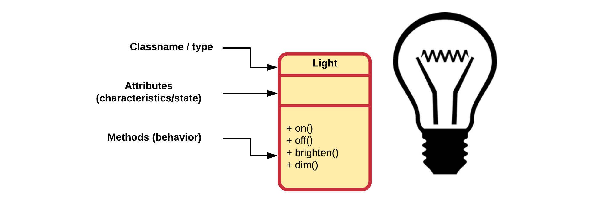

## Interface of an Object

Objects can be manipulated by sending them messages. Objects satisfy the requests that are being send to them (ex. draw something on the screen, complete a bank transaction, download a file from the Internet, ...).

In practice, a *contract* is created between the creator of the class and the user of the class, which defines what messages can be send to a certain class of objects. This contract is realized by the **interface** of the objects. In other words the interface of a class establishes what requests you can make to its objects.

There must however be code somewhere to satisfy the requests. This along with the hidden data comprises the *implementation* of the class.

So summarized: a type (class) has a method associated with each the possible requests (the interface) that can be made to the objects of that class. When a message is send to an object, the corresponding method is called, and the object figures out what to by executing the code that forms the implementation of that method.

Lets take a look at a simple example such as a light bulb. It might be represented as shown below.

The diagram above follows the UML standard (Unified Modeling Language). The diagram consists of three parts:

* The top box shows the **name of the class**. In this case Light. Note how the class name begins with a capital letter and is in the singular form.
* Below that is a list of **attributes**. They contain the characteristics or state of the objects that will be created from the class.
* Last is the box with the **methods** that are available for the class.

Except for the name of the class, the other parts of the diagram are optional and are only added when useful.
