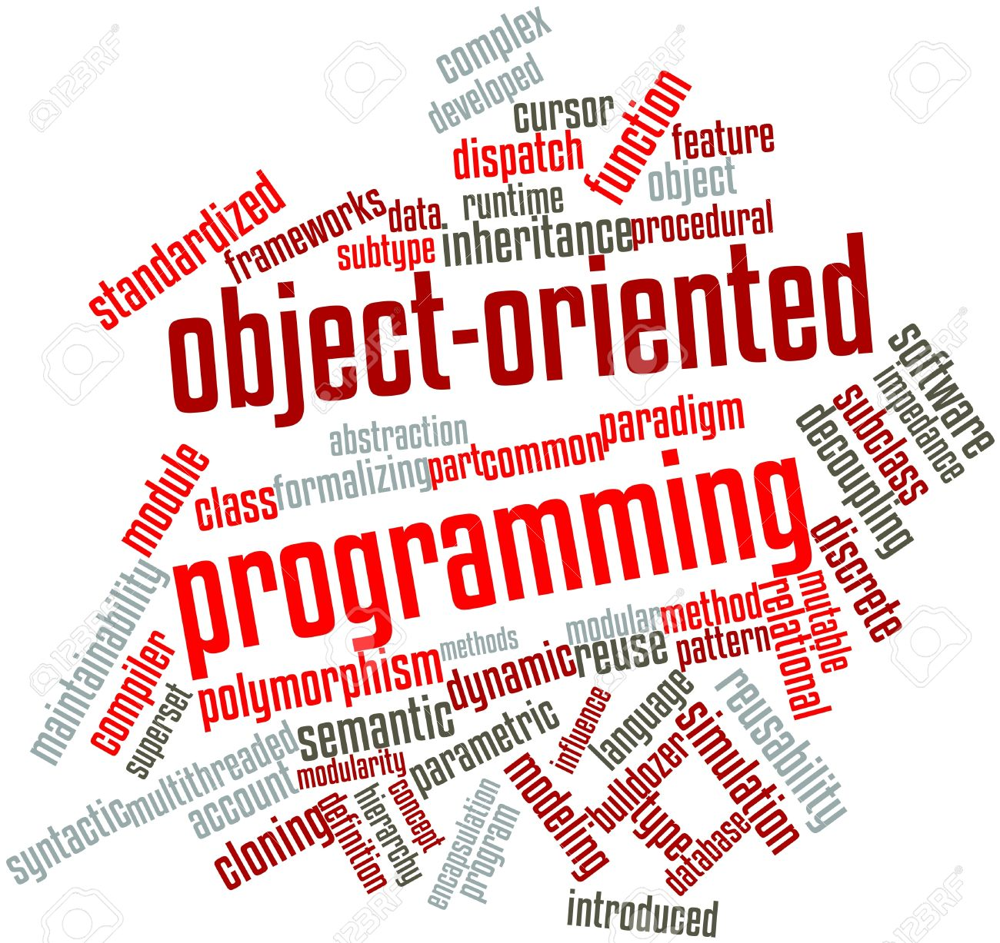

[All About Objects](../all_about_objects/readme.md)
* [What are Objects](../all_about_objects/what_are_objects.md)
* [Classes](../all_about_objects/classes.md)
* [Interface of an Object](../all_about_objects/interface_of_an_object.md)
* [Characteristics of OOP](../all_about_objects/characteristics_of_oop.md)

# All About Objects

This chapter will give a detailed introduction in the concepts of object oriented thinking when using an object oriented programming (OOP) language such as Java or C++. This chapter will not include any language specific language examples. Everything will be language independent and supported using UML (Unified Modeling Language) class and object diagrams.

<!-- TODO: Replace this image with own -->
