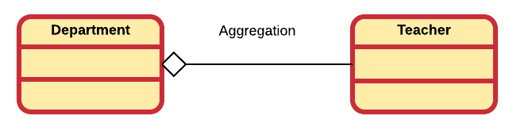

## Reusing Implementation

Once a class has been created and hopefully tested it should ideally represent a useful unit of code.  In this case it begs to be reused and not go to waste. It also turns out that code reuse is one of the main advantages of object oriented programming.

> #### Warning::Reuse and DRY
>
> Code reuse is not, as some understand it to be (students in particular), the ability to be copy pasted from one part inside your program to another! This is actually *code duplication* and is considered bad practice. The DRYness (DRY - Don't Repeat Yourself) of once code is one of the indicators of the maintainability of that code.

Multiple ways exist to reuse a class:

* **Association**: Just use the objects of a class.
* **Composition/Aggregation**: Build classes that consist of other objects.
* **Inheritance**: Extend an existing class by inheriting from a base class.

### Association

The simplest way to reuse a class is by creating objects from it and using those objects. In other words an object of one class may use services/methods provided by an object of another class. This kind of relationship is termed as an association.

An association represents a relationship between two or more objects where all objects have their own lifecycle[^3] and there is no owner[^4]. The name of an association specifies the nature of relationship between objects. This is represented in UML by a solid line.

[^3]: The life cycle of an object is the time between an object's creation and its destruction. Rules for object lifetime vary significantly between languages, in some cases between implementations of a given language, and lifetime of a particular object may vary from one run of the program to another.

[^4]: [TODO] Needs a decent definition

Let's take an example of relationship between Teacher and Student. Multiple students can associate with a single teacher and a single student can associate with multiple teachers. But there is no ownership between the objects and both have their own lifecycle. Both can be created and deleted independently.

### Aggregation and Composition

Another way to reuse implementation is by creating classes that consist of other objects. In this case a differentiation can be made between what is called aggregation and composition.

**Aggregation** is a specialized form of association where all object have their own lifecycle but there is ownership. This represents "whole-part or a-part-of" relationship. In UML this is represented by a hollow diamond followed by a line.

Let's take an example of a relationship between Department and Teacher. A Teacher may belong to multiple departments. Hence Teacher is a part of a Department. But if we delete a Department object, no Teacher objects will be destroyed.

**Composition** is a specialized form of aggregation. It is a strong type of aggregation. In this relationship child objects do not have their own lifecycle. If a parent object is destroyed, all its child objects will also be destroyed. This represents a "death-relationship". In UML this is represented by a solid diamond followed by a line.

Let's take an example of relationship between a House and a Room. House can contain multiple rooms, but there is no independent life of Room and a Room cannot belong to two different houses. If we destroy the house, the rooms will automatically be destroyed too.

While a clear distinction is made here between aggregation and composition, it is not always done so in practice. In practice, one does often speak of composition even if he/she were to mean aggregation. As a result this course may also use the word composition where aggregation is meant. Of course in cases where a clear distinction is needed, the correct term will be used.

Composition/Aggregation comes with a great deal of flexibility. Member objects of the new class can be made private, making them inaccessible to client programmers. This means that they can be changes without disturbing existing client code. This can even be done at runtime[^5], to dynamically change the behavior of your program. This cannot be done using inheritance since the compiler must place compile-time restrictions on classes created with inheritance.

[^5]: In computer science, at runtime is the time during which a program is running (executing), in contrast to other program lifecycle phases such as compile time, link time and load time.

Because inheritance is one of the main pillars of object oriented design, it is often over-estimated and over-used. When used wrongly, it can result in awkward and overly-complicated designs. A good practice is to look at aggregation/composition first when creating new classes as it is simpler and more flexible. Later in this course some good guidelines will be given on when to use or not to use inheritance.
