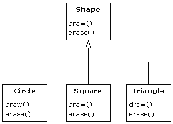
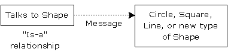
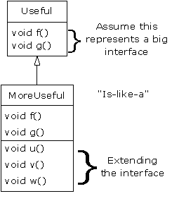
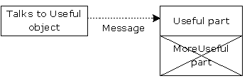

## Reusing the Interface - Inheritance

The concept of an object is a convenient tool. It allows you to package data and functionality together by concept. It would be a pity if one had to go through all the trouble to create a class and then be forced to create a brand new one even if it is very similar to the other one.

It's much more convenient to be able to clone classes and make additions and modifications to this clone. This is exactly what **inheritance** allows us to do. Inheritance lets you reuse classes as new classes that might have a similar functionality. On top of this, if the original class is modified, these modifications are also reflected in the clones.

Inheritance is visualized in a UML class diagram using an arrow from the new class (called the **derived, inherited, child or sub class**) to the original class (called the **super, base or parent class**).

Object-oriented programming allows classes to inherit commonly used state and behavior from other classes. In an inheritance hierarchy the base class contains all the common characteristics and behaviors of the derived classes. The more specific behaviors and characteristics can be found in the derived classes.

When inheriting from an existing type, you create a new type. This new type contains all the data members (even private once, although they are hidden and inaccessible) as well as duplication of the interface of the base class. In other words, objects of the derived class can receive the same messages as the original base class objects.

Let's take a look at the inheritance hierarchy shown in the following Shape example.

The base type here is the *Shape* class. All shapes have a size, color, position, ... All shapes can be drawn, erased, moved, colored, ... Specific shapes, such as Circle, Square and Triangle, are derived from this base class and inherit these characteristics and behavior.

Each subclass may also have additional characteristics and behavior. For example a circle has a radius while a square has the size of its side and a triangle has its width and height. Some addition behavior may be added, such as the ability to flip a Triangle (useless for a Circle and Square).

Besides that, some behavior may also be altered. For example drawing the shapes will be different for each type of Shape. This is referred to as overriding a method. When overriding a method, you keep the same interface method, but the definition (implementation) will differ from the original one.

Since all the subtypes can receive the same messages as the base type, it can be stated that the derived class is the same type as the base class. This means that we can state that:
* a Circle is a Shape
* a Square is a Shape
* a Triangle is a Shape

Because of this, inheritance is often called a **"is-a relationship"**. This can also serve as a check to see if inheritance is the correct path to follow. Type equivalence via inheritance is one of the fundamental gateways in understanding the meaning of object-oriented programming

Let's for example take a look at the following inheritance hierarchy. It may look acceptable if you state that a Bicycle is a sort of means to drive from point A to point B which you have modelled for your program. Later upon expanding your program you needed a model for a Car and noticed that it is a vehicle that can also drive from point A to point B. The only difference is that you need to keep track of mileage and allow it to be locked.

Now if you try out the same guideline and state "a Car is a Bicycle" you can definitely feel that something went wrong. While the design flaw can be spotted pretty easy here, it will not always be so obvious. A solution might be as simple as renaming Bicycle to Vehicle and if necessary create a subtype of Vehicle called Bicycle at the same level as Car.

### Is-a versus is-like-a relationship

When studying inheritance, it would seem that the cleanest way to create an inheritance hierarchy is to take the "pure" approach. That is, only methods that have been established in the base class or interface are to be overridden in the derived class, as seen in this diagram:

This can be called a pure "is-a" relationship because the interface of a class establishes what it is. Inheritance guarantees that any derived class will have the interface of the base class and nothing less. If you follow this diagram, derived classes will also have no more than the base-class interface.

This can be thought of as pure substitution, because derived class objects can be perfectly substituted for the base class, and you never need to know any extra information about the subclasses when you're using them.

That is, the base class can receive any message you can send to the derived class because the two have exactly the same interface. All you need to do is upcast from the derived class and never look back to see what exact type of object you’re dealing with. Everything is handled through polymorphism.

When you see it this way, it seems like a pure is-a relationship is the only sensible way to do things, and any other design indicates muddled thinking and is by definition broken.

This too is a trap. As soon as you start thinking this way, you'll turn around and discover that extending the interface (which, unfortunately, the keyword `extends` seems to encourage) is the perfect solution to a particular problem. This could be termed an "is-like-a" relationship, because the derived class is like the base class - it has the same fundamental interface - but it has other features that require additional methods to implement:

While this is also a useful and sensible approach (depending on the situation), it has a drawback. The extended part of the interface in the derived class is not available from the base class, so once you upcast, you can't call the new methods:

If you're not upcasting in this case, it won't bother you, but often you'll get into a situation in which you need to rediscover the exact type of the object so you can access the extended methods of that type.

Consider the example of a house that wired with controls for a cooling system; that is, it has an interface to control cooling.

Imagine that later on you decide to replace the air conditioner with a heat pump which has both a heating and cooling system. The heat pump "is-like" your previous air conditioner but it can do more. Because your control system is limited to cooling, it can only talk to the cooling part of the new object. The new interface of the new system has been extended and the existing system doesn't know about anything but the original interface.

Once you take a good look at the design it may become clear that the base class is not general enough and should be renamed to "TemperatureControlSystem" so that it can also include heating. At this point it would be possible to talk about "pure substitution".

However, this is quite a trivial example and real-world designs might not be so obvious.

You may feel that pure substitution is the only way to go, and in fact it is nice if your design works out this way. However there will be times when it is equally clear that you need to extend the base interface with new methods.
