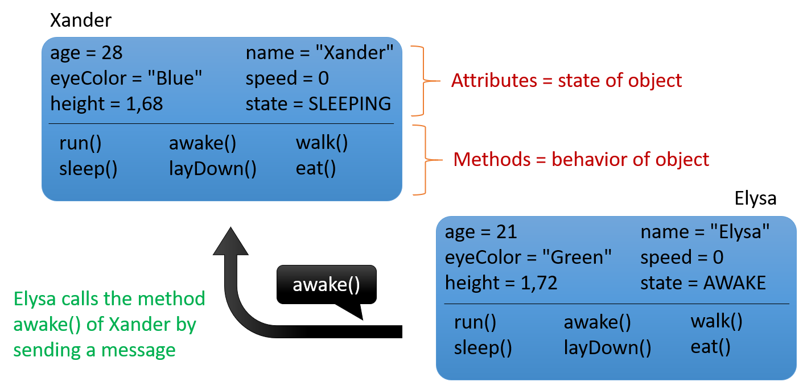

## What are Objects

What is an object ?

Sounds like a complex question, but the answer is actually really simple. Humans already tend to **think in terms of objects**, without taking to much effort. Students already know about objects, even if they don't realize it.

Actually **all things around us can be considered objects**: a chair, a table, a monster truck, an electricity outlet, a window, a student, a teacher, ... but also more abstract things such as a bank account, a computer file, a chemical element, ... When thinking in terms of objects in software design we will find such objects as an email, a browser, a text message, a mouse, an icon on your desktop, ... All these things are examples of objects.

Basically one can state that something is an object if it has:
* **a name**;
* certain **characteristics**;
* certain **actions** that can be done to it or can be accomplished with it.

### Object Characteristics

If you are reading this in a classroom, than take a look around you. Try to focus on a person in the room. She/he is the perfect example of an object. First of all he/she has a name which uniquely identifies this person.

Now try to identify some characteristics of this person. Some examples could be his/her:
* name
* age
* eye color
* gender
* position (sitting, standing, laying down, ...)
* height
* ...

In object oriented programming these **characteristics** are often referred to as the **attributes** or **properties** of an object. They define the **data** that contain the current **state** of the object at any given moment.

Each object holds its own state. This means that you can have a person in the classroom that is sleeping and another that is sitting straight. If one person grows an inch over a couple of months, this does not mean the others do so too. They each have their own individual state.

### Object Behavior

Take another look at someone in the classroom. What actions can a person perform ? He/she can:

* walk
* sleep
* talk
* eat something
* stand up
* ...

In object oriented programming these are called the **methods** of an object. They define the possible **behavior** of an object.

Most of the actions that are performed by or to an object are based on the current state of the object. If a person is not hungry he/she will react differently when given an apple than when you have been starving him/her for weeks.

### Objects Talk to Each other

Most objects will only become useful if they can **interact with other objects**. Take for example a chair in the middle of a room full of people. The chair is pretty useless until someone decides to sit on it.

Interaction between objects in a software program is accomplished by an object sending a **message** to another object. Of course it is part of your job as a programmer to determine which objects send messages to each other and when. In an object oriented programming language sending a message from one object to another is accomplished by **calling a method** of an object.

Take a look at the following example. It defines two people (objects): Xander and Elysa. Both have their own state (attributes or data) and have certain actions that they can perform (run, sleep, eat, ...). The diagram shows that Elysa is sending a message to (calling the awake() method) Xander who is asleep.

While the diagram above is no official standard it does however places a base for the UML standard that will later be used in this course. Note how attributes and methods are separated. It also shows some programming basics such as the parentheses after a name of a method or the naming conventions of the attributes.

### Definition of an Object

All this leads to a more formal definition of an object:

> #### Definition::Object
>
>  An object is an entity that contains both **data** (*attributes*) and **behavior** (*methods*). Objects exchange information with each other and request actions from one another by sending messages. In code this is achieved by calling the methods of the objects. These methods can act upon the current state of the object and also make changes to it.

### Quick Summary

* Objects are the building blocks of an OO program
* A program is basically a **collection of objects**
* An **object** is an **entity** that contains both data and behavior
  * **Data** represents the state of the object and is represented by **attributes** of the object
  * **Behavior** represents what the object can do in the form of **methods**
* Objects **interact** with each other by sending messages
  * In the form of **method calls**
