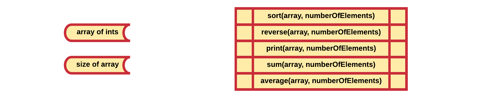

## Why OOP

Before the mid 1970s software engineers followed a programming methodology called **structured programming**.

> #### Info::Structured Programming

> Structured programming is a programming paradigm aimed at improving the clarity, quality, and development time of a computer program by making extensive use of subroutines, block structures, for and while loops—in contrast to using simple tests and jumps such as the `goto` statement, which could lead to "spaghetti code" that is difficult to follow and maintain. It emerged in the late 1950s with the appearance of the ALGOL 58 and ALGOL 60 programming languages, with the latter including support for block structures.

The structured paradigm offered a simple approach to software engineering by providing a simple view on a software product. An application was considered to be either *operation oriented* or *data oriented*. In the case of operation oriented applications the focus lies on the functions that the application performs as where data oriented focused on the data being handled. However as software development began to evolve and applications became more complex, developers realized that this approach was to narrow sighted.

New software concepts began to emerge, one of which was the object oriented paradigm. This became of the most popular and most influential ones. Instead of breaking software down into either data or operations, object oriented programming took another approach by dividing application into **abstract software artifacts called objects**. Objects are **designed to keep both data and operations together** as a logical entity.

Take for example a car. In structured programming the properties of the car and the actions it could perform would be kept separately. Take for example physical characteristics such as its color, serial number, engine type, number of seats, ... is kept separate from actions such as steering, accelerating, slowing down, stopping, ...

Applying the object oriented paradigm, all these properties (called attributes then) and actions (called methods then) would be combined into a single logical entity (the object) called a **Car**. An car object is able to use its internal attributes and perform certain actions. It can be thought of as a single independent unit rather than an separated but entangled bunch of functions and data.

### List of Numbers

Let us take a look at a more software oriented example. Take for example a simple application that holds a list (an array) of integers taken as input from the user. The application has at least two properties to track: the numbers themselves and how many entries are in the array.

Now the user is able to select what operation to perform on the list of numbers: reverse the list, make the sum, make the average, print the list to the screen, ...

Taking the structured programming approach the data and operations would be totally separate from each other as demonstrated in the diagram below.

As can be seen above, all data required for the operations need to be passed to the functions or they need to be made globally available which is even worse.

Now taking the object oriented approach a nice independent entity called `ListOfNumbers` can be engineered. It holds both the integers and the number of elements internally. Several actions can be requested from such an object such as `sort()`, `reverse()`, `print()`, ... Take note that the data does not need to be passed to the actions as they already have access to it as the internal state of the object.

While not only cleaner, more logical and maintainable, the object oriented approach also provides us with a lot more options for reusing code.
